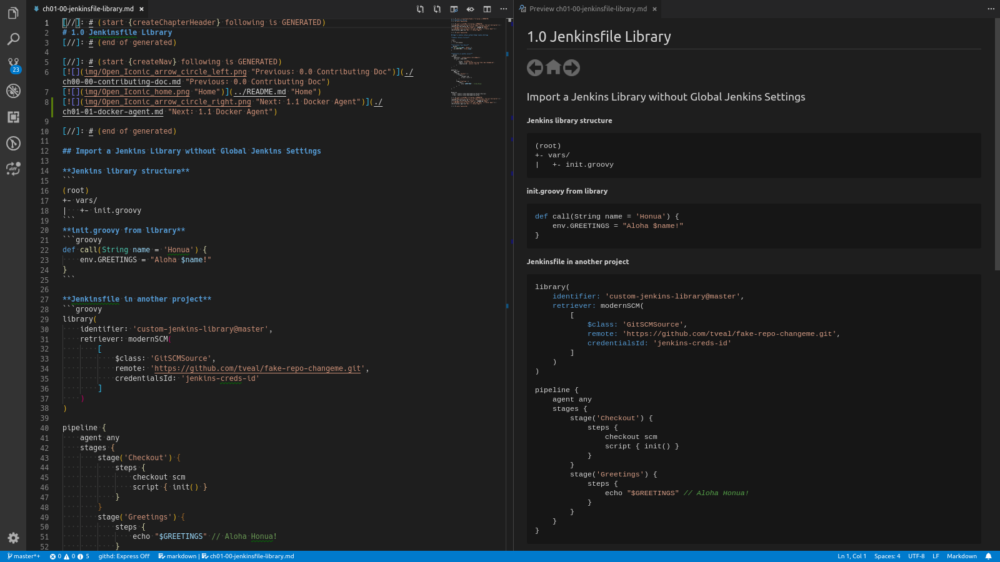
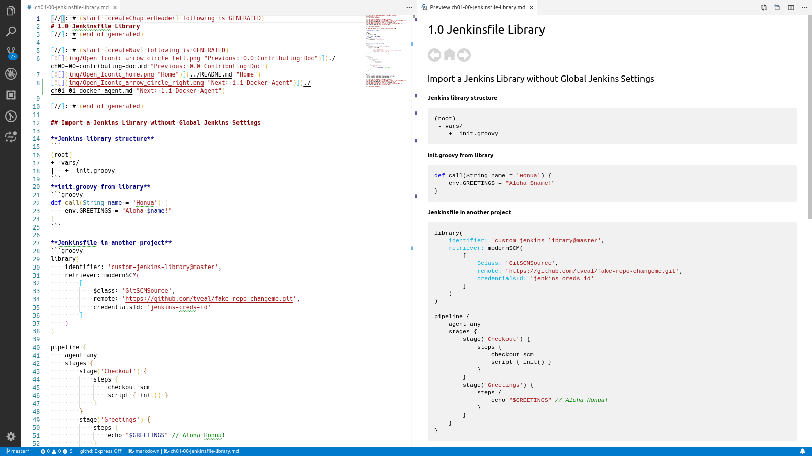

[//]: # (start {createChapterHeader} following is GENERATED)
# 0.0 Contributing Doc
[//]: # (end of generated)

[//]: # (start {createNav} following is GENERATED)
[](../README.md "Home")
[](./ch01-00-jenkinsfile-library.md "Next: 1.0 Jenkinsfile Library")

[//]: # (end of generated)

## Before you begin

This documentation book utilizes dynamic content, but to do so, it needs to be built
anytime there's a change to dynamic content. The build also sets up a git hook
(pre-commit) to protect you from accidentally committing changes without updating the
dynamic content of the book. Run the following to ensure everything is setup before
you contribute to the book (run from the project root):

```bash
./gradlew build
```

As this build uses Gradle, you do need Java 8 or higher.

## Adding new doc files

1. Run a command like the following, changing the _second_ filename appropriately:

    ```bash
    cp book/sample-chapter.md book/ch03-02-my-new-chapter-section.md
    ```
    ch03-02 corresponds to the chapter-section number (3.2 in this example)

2. Build the book to update the dynamic content with the new file

    ```bash
    ./gradlew buildBook
    ```

3. Edit your new file as desired. Tip: use VSCode with preview (or IntelliJ) to see
    real-time changes in pretty mode.



If using VSCode, you can also switch your theme to a light theme to see what your doc
looks like with a white background. Press `Ctrl + Shift + P`, type "theme", and select
"Preferences: Color Theme"; Then select the theme you want.



**Book file requirements**
- Must be in the book directory
- The filename must start with lowercase `ch`, followed by 2-digit chapter number
and 2-digit chapter section.
- Delimit with dashes
- The remaining parts of the filename become the doc title for dynamic content
- Use dynamic content (see next section) to add a header as well as navigation buttons
    (included in the sample file)

```md
ch03-02-my-new-chapter-section.md
```

This filename results in a linked TOC entry: **3.2 My New Chapter Section**

## Adding dynamic content to doc files

1. You need to know how to add an invisible comment in markdown. This can be
    done like so:

    ```
    [//]: # (some invisible comment)
    ```

2. You must have a start and an end invisible comment like so:

    ```
    [//]: # (start)
    [//]: # (end)
    ```

    Any lines between the start and end invisible comments will be **removed**; so if you don't 
    provide an _end_ invisible-comment, then everything after the start will be removed!

3. In the start invisible comment, inside the parenthesis after the "start" word, place
    a vadlid function call from the DocFunctions class defined in the
    [build.gradle](../build.gradle) file
    - without additional parenthesis
    - surrounded by braces `{}`
    - you can also add helpful notes to the start/end invisible comments

    To generate a Table of Contents
    ```
    [//]: # (start {createToc} following is GENERATED)
    [//]: # (end of generated)
    ```
    To generate a chapter header _(only in book/ch* files)_
    ```
    [//]: # (start {createChapterHeader} following is GENERATED)
    [//]: # (end of generated)
    ```
    To generate navigation buttons _(only in book/ch* files)_
    ```
    [//]: # (start {createNav} following is GENERATED)
    [//]: # (end of generated)
    ```

## Add/Modify Chapter Description

You can set chapter descriptions in the [config.yml](./config.yml) file under
`book.chapters.ch#.desc`. If you do not set one, it will default to "Chapter #".

```yml
book:
  chapters:
      ch1:
        desc: About the Book
      ch2:
        desc: Jenkins
      ch3:
        desc: Bash
```


[//]: # (some invisible comment)
[//]: # (https://alvinalexander.com/technology/markdown-comments-syntax-not-in-generated-output)


[//]: # (start {createNav} following is GENERATED)
[](../README.md "Home")
[](./ch01-00-jenkinsfile-library.md "Next: 1.0 Jenkinsfile Library")

[//]: # (end of generated)
